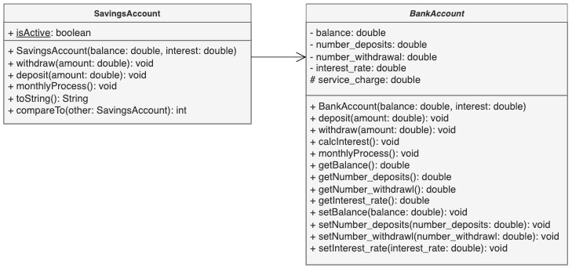

# Inheritance_AbstractClass Project

This project demonstrates the use of inheritance and abstract classes in Java. It consists of three classes: `BankAccount`, `BankService`, and `SavingsAccount`.

## BankAccount.java

This is an abstract class containing various methods for deposit, withdrawal, and service charges. It serves as the base class for `SavingsAccount`.

### Methods

- `deposit(double amount)`: Adds balance to the account.
- `withdraw(double amount)`: Deducts balance from the account.
- `calcInterest()`: Calculates interest accrued.
- `monthlyProcess()`: Tracks deposits and withdrawals, and calculates service charge.

## BankService.java

This class contains the `main` method where random `SavingsAccount` objects are created, and various operations like deposit, withdrawal, and monthly processing are performed.

## SavingsAccount.java

This class extends `BankAccount` and implements the `Comparable` interface. It represents a savings account with additional functionality such as checking if the account is active, limiting withdrawals, and sorting based on balance.

### Methods

- `compareTo(SavingsAccount other)`: Compares two savings accounts based on balance.

## Usage

To use this project, follow these steps:

1. Clone the repository to your local machine.
2. Open the project in your preferred Java IDE.
3. Run the `BankService.java` file to execute the program.

## Example Output

## UML Diagram
