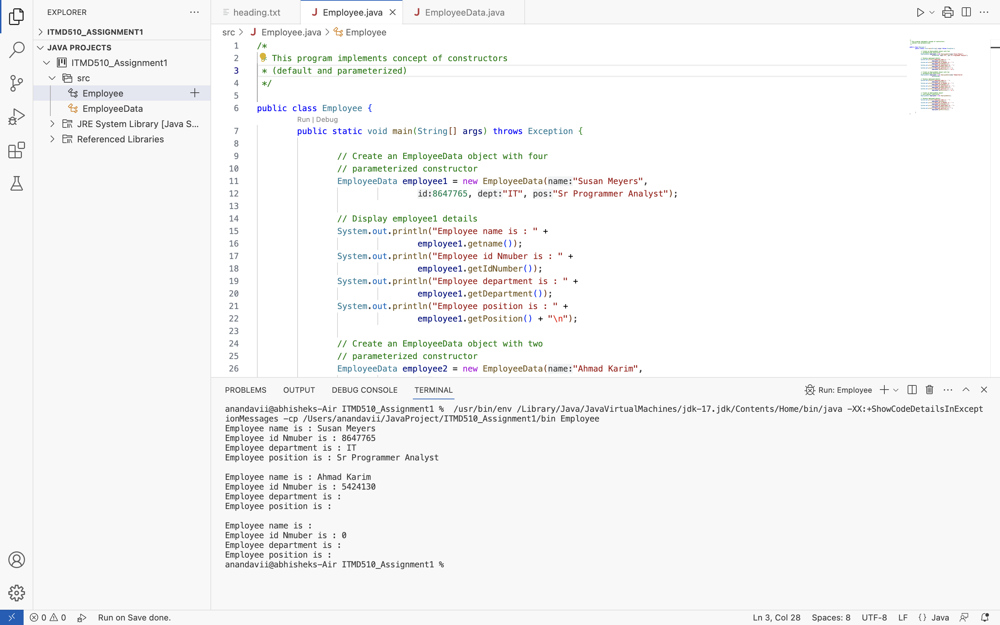

# Constructors

This project demonstrates the concept of constructors in Java. It consists of two main classes: `EmployeeData` and `Employee`.

## EmployeeData.java

This class defines the structure of employee data and includes multiple constructors to initialize employee objects with different sets of information.

## Employee.java

This class contains the main method to demonstrate the usage of constructors defined in the `EmployeeData` class. It creates instances of `EmployeeData` with different constructor invocations and displays the employee details.

## Usage

To use this project, follow these steps:

1. Clone the repository to your local machine.
2. Open the project in your preferred Java IDE.
3. Run the `Employee.java` file to execute the program.

## Class Descriptions

### EmployeeData.java

- **Purpose**: Defines the structure of employee data and constructors for initializing employee objects.
- **Methods**:
  - `EmployeeData(String name, int id, String dept, String pos)`: Parameterized constructor to initialize employee data with name, id, department, and position.
  - `EmployeeData(String name, int id)`: Parameterized constructor to initialize employee data with name and id.
  - `EmployeeData()`: Default constructor to initialize employee data with default values.

### Employee.java

- **Purpose**: Main class to demonstrate the usage of constructors defined in the `EmployeeData` class.
- **Methods**:
  - `main(String[] args)`: Entry point of the program. Creates instances of `EmployeeData` with different constructor invocations and displays employee details.

## Example Output

